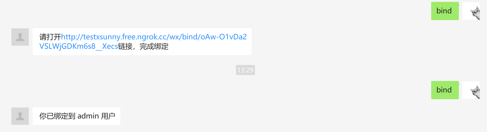
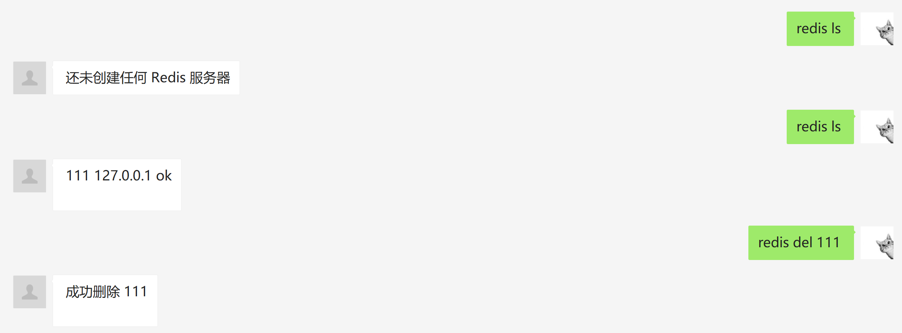
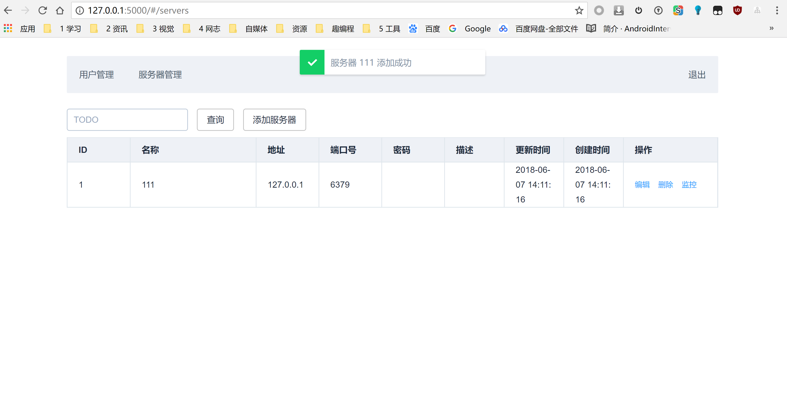
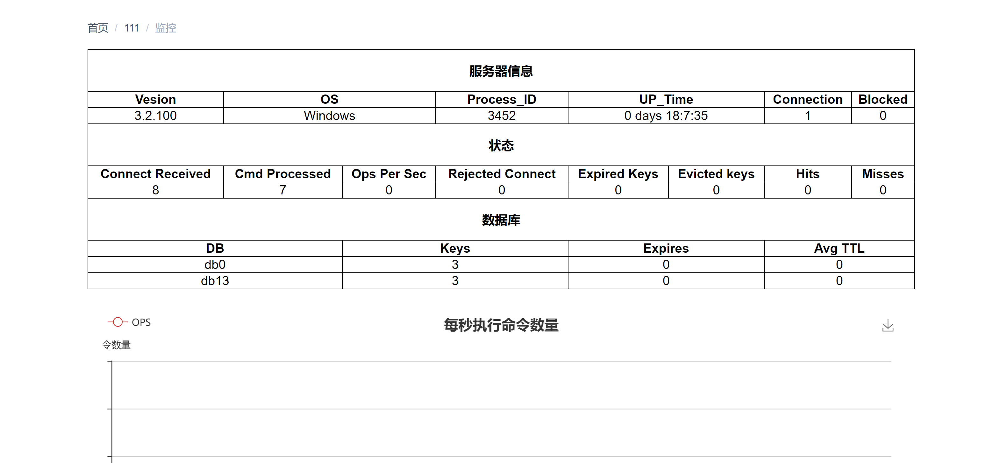

# Redis-Monitor
Redis-Monitor是一个Redis 服务器监控工具
,实现了 Redis 服务器管理和监控信息获取的 API
并支持链接微信公众号，微信上操作redis服务器的增删改查

# 功能设计
RM支持 Redis 服务器的增删改操作，并支持获取具体某一个服务器的监控信息。总结如下：

获取 Redis 服务器列表；
获取 Redis 服务器详情；
更新 Redis 服务器；
删除 Redis 服务器；
获取 Redis 服务器的监控信息；
# API设计
|Name|URL|HTTP|Success Code|Fail Code|
|---|---|---|---|---|
|获取服务器列表 | /servers/| GET|200|500|
|创建服务器 | /servers/| POST|201|400|
|获取服务器 | /servers/server_id| GET|200|404|
|更新服务器 | /servers/server_id| PUT|200|404/400|
|删除服务器 | /servers/server_id| DELETE|204|404|
|获取服务器监控数据 | /servers/server_id/metrics| GET| 200 | 404/500|
|微信验证与指令|/wx/|GET|200|404/400|
|微信绑定|/wx/bind/<wx_id>|GET/POST|200|404/400|
|登录|/login|POST|200|404/400|
|用户管理|/users/|GET|200|404/400|
|用户详情|/users/<object_id>|POST|200|404/400|

# 运行截图

